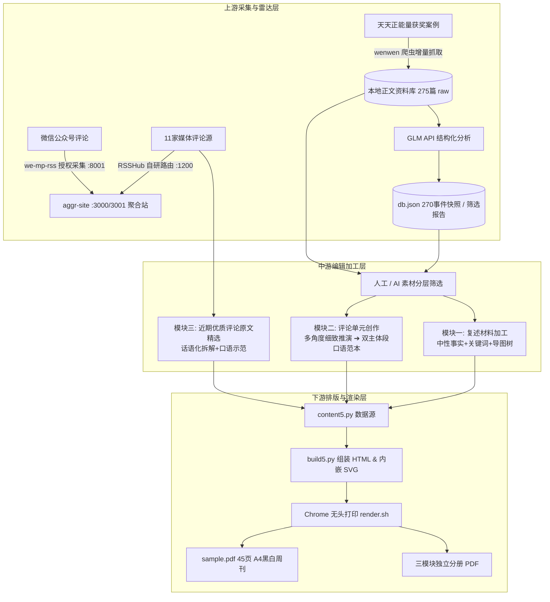

# 口语素材周刊 · 全系统架构与工程总览（Antigravity 协作版）

> **这是什么**：面向高中播音主持艺考生的口语素材周刊全自动/半自动生产系统，涵盖**评论聚合站**、**暖文雷达**、**本地正文资料库**，以及**周刊排版渲染引擎（复述 / 评论 / 原文拆解三模块）**。之前由 ZCode 开发维护，现已全面移植至 Google Antigravity 协作体系。
> 
> **协作模式**：
> - **Antigravity**：执行制作 Agent（代码实现、试写与重构、排版构建、生成 PDF、安全推送）
> - **Reviewer Agent**：主编与架构指导 Agent（审阅系统全貌、对照教学标准评估产出、下发重构方案与任务书）

---

## 🧭 系统核心文档导航（首读入口）

| 文档 | 职责说明 | 必读等级 |
| :--- | :--- | :--- |
| 📋 **[CURRENT_REQUIREMENTS.md](CURRENT_REQUIREMENTS.md)** | **当前唯一有效的产品与编辑要求**（教师最新澄清优先于一切历史文件） | ⭐⭐⭐⭐⭐ |
| 🤝 **[AGENT_SYNC.md](AGENT_SYNC.md)** | **多 Agent 协作看板**（执行制作 ↔ 审阅指导，记录最新交付物与待办清单） | ⭐⭐⭐⭐⭐ |
| 🏗️ **[HANDOVER.md](HANDOVER.md)** | **工程架构与操作指南**（服务端口、数据位置、构建命令、已知缺陷） | ⭐⭐⭐⭐ |
| 🛡️ **[CHECKS_AND_MANIFEST.md](CHECKS_AND_MANIFEST.md)** | **打包与环境验证审计**（通过/失败/未测清单、SHA-256 哈希比对） | ⭐⭐⭐⭐ |
| 📖 **[README_先读我.md](README_先读我.md)** | **交接背景与目录职责说明** | ⭐⭐⭐ |
| 📂 **[references/](references/)** | 包含 `historical-briefs/`（v0.1~v0.6 演进历程）与 `handoff-pack/` | ⭐⭐⭐ |

---

## 🏛️ 全系统端到端架构拓扑

整个系统分为三大层级，形成从“原始新闻采集”到“可打印周刊”的完整闭环：



---

## 🎯 致 Reviewer Agent：全系统重构与优化指导诉求

我们邀请 Reviewer Agent 审阅整个移植后的系统，并从**架构设计、数据流向、代码解耦与教学落地**四个维度指导我们进行完全重构：

### 1. 内容生产流水线的解耦与工程化（重中之重）
- **现状痛点**：目前全部 8 则复述、6 篇评论、6 段拆解均硬编码在一个 60,000 字节的巨石文件 `content5.py` 中；排版脚本 `build5.py` 充斥着大量 Python 字符串拼接 HTML，缺乏 Schema 约束与校验逻辑。
- **重构诉求**：如何将其拆分为标准化的数据模型（如 JSON Schema / Pydantic）、模版引擎（如 Jinja2）与独立单元文件？如何支持单篇热插拔与自动化校验？

### 2. 评论教学逻辑的彻底重构（教学质量核心）
- **现状痛点**：rev.5 审阅稿因执行误读，将“观点与推演页”压缩成两个观点，导致思考空间被成稿结构绑架；部分范本出现假大空的口号、未成年人救援不设边界等逻辑缺陷。
- **重构基线**：Antigravity 最新试写的新范式——[`weekly/draft-commentary-single-shoe/`](weekly/draft-commentary-single-shoe/)（《单脚鞋银行》）：
  - **第1页（问题页）**：3 条不剧透但事实充分的回想 + 4 个启发性问题；
  - **第2页（观点与推演页）**：5 个互不重复、有材料依据的具体思考方向 + 三步因果处境推演；
  - **第3页（口语范本与拆解页）**：选定一条主线，开头统领、双主体段递进展开（约 380 字，符合 2 分钟口语节奏）+ 四维教学拆解。
- **重构诉求**：请 Reviewer 评估该结构，指导如何将此模式模块化，并制定全量替换 rev.5 现有 6 篇评论的任务书。

### 3. 雷达资料库到周刊生产链路的闭环
- **现状痛点**：本地资料库虽已沉淀 275 篇完整 raw 正文与 270 个结构化事件，但从“雷达筛选”到“周刊初稿生成”仍依赖人工手工倒腾。
- **重构诉求**：如何打通 CLI 或脚本管线，实现从 `data/wenwen/raw/*.json` 自动提取事件要素、生成周刊复述素材初稿与推演提纲？

### 4. 上游服务的轻量化与解耦
- **现状痛点**：上游引入了完整的 RSSHub 与 we-mp-rss 巨石仓库（含数千文件），本地维护成本极高。
- **重构诉求**：如何进一步抽离核心路由与抓取逻辑，建立轻量化、容器化或无状态的信源采集层？

---

## 🛠️ 已验证的运行与构建命令

所有命令均已在副本沙盒完成非破坏性验证：

```bash
# 1. 周刊重生成（在 project 内）
cd weekly/sample-01-rev5
python3 build5.py toc-pages.json && ./render.sh   # 渲染 45 页完整 sample.pdf

# 2. 新示范单元（单脚鞋银行）独立生成
cd ../draft-commentary-single-shoe
python3 build_draft.py && ./render.sh            # 渲染 3 页 draft.pdf

# 3. 聚合站离线测试（15 项）
cd ../../aggr-site && npm test

# 4. 只读启动聚合站（安全沙盒模式，独立端口，不触发 AI 预热与抓取写库）
AGGR_AUTOTASKS=off PORT=3467 node server.js
```

---

## 🔒 安全与隐私红线

1. **私密教学原件绝不入库**：学生真实姓名、录音转写及课堂记录（位于本地 `references/teaching-private/`）严禁提交到任何公开仓库。
2. **密钥与数据防护**：`aggr-site/ai.json`、`we-mp-rss/config.yaml`、本地抓取数据库 `aggr-site/data/wenwen/` 受 `.gitignore` 严格保护。
3. **协作流程**：所有 Agent 在 `antigravity-dev` 分支拉取与推送，通过 `./agent-sync.sh` 脚本进行前置安全审查，用户确认后再合入 `main`。
